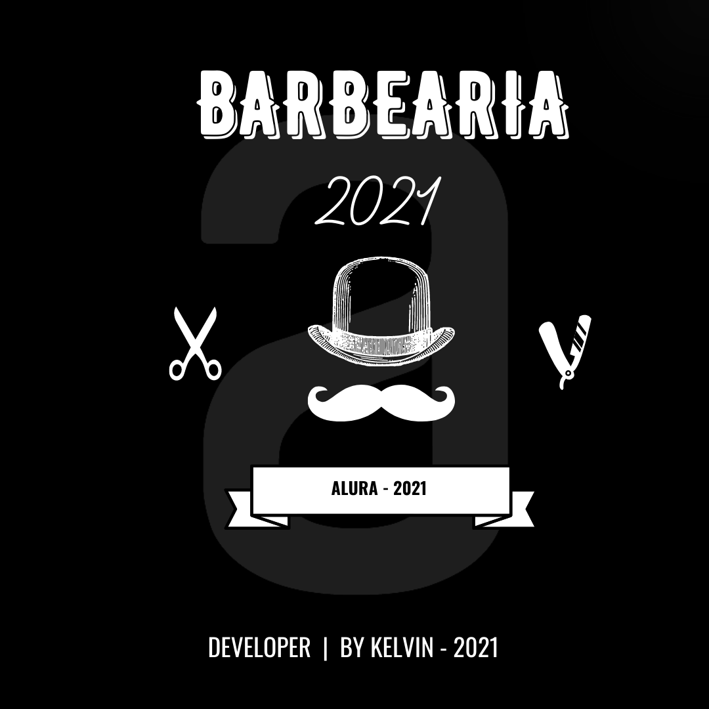
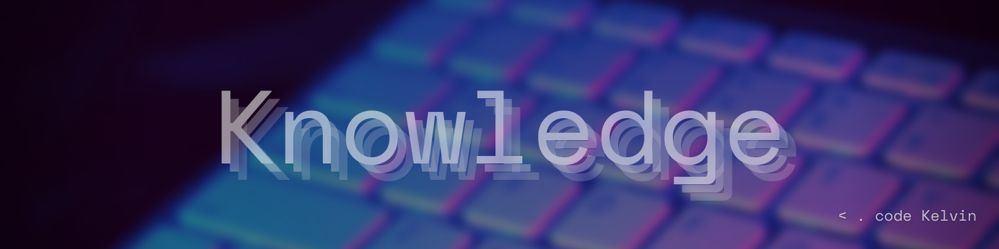

<h1 align="center">Barbearia - 2021</h1>

<H2 align="center">👩‍💻 O que obtive de conhecimento ao longo do Projeto 😮 </H2>

### Ao longo do desenvolvimento de <a href="#">Marcação de texto</a> &  <a href="#">Folha de estilo</a> : 

1. Part:

    - o que é o HTML e o CSS;
    - Entendimento da estrutura básica de um arquivo HTML;
    - Utilizar o navegador para inspecionar elementos;
    - Definir estilos para elementos usando o CSS;
    - Desenvolvi uma página Web;

2. Part:

    - Aprendi a estrutura da página HTML;
    - Navegar entre páginas web;
    - Conheci reset.css e o posicionamento pelo CSS;
    - Entendi a diferença entre inline e block;
    - Lidei com bordas e pseudo-classes CSS;

3. Part:

    - Criei formulários complexos;
    - Trabalhei com campos para celulares;
    - Apresentei informações em tabelas;
    - Usei estilos para formulários, campos e tabelas;
    - Entendi a hierarquia no CSS;
    - Trabalhei com transformações e transições;

4. Part:

    - Importei conteúdo externo na minha página HTML, como fontes, vídeos e mapas;
    - Conheci pseudo-classes e pseudo-elementos;
    - Seletores de CSS avançados;
    - Como lidar com opacidade e sombra;
    - Entendimento sobre o Viewport e design responsivo;

## Visualize o Projeto Hospedado:

- <a href="#">Git-Pages</a> 
- <a href="#">Vercel</a> 

## Faça Networking comigo:
-  <a href="https://www.linkedin.com/in/kelvinreis-adm/">LINKEDIN</a> 